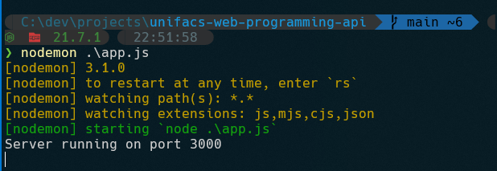

> Repositório do projeto do curso de ciência da computação da UNIFACS, matéria `Desenvolvimento de Software para Web`

Dependências:

```
node.js na versão 21.7.1 ou versão compatível
```

```
Para Windows:
scoop install node (vem com npm)

Archlinux:
yay -S nodejs npm
```

Passo a passo

Executar o comando em qualquer path do sistema no terminal (instala o programa nodemon no path global do sistema, sendo possivel o executar de qualquer pasta)
```sh
npm i -g nodemon
```

No path onde se encontra o repositório, executar
```sh
npm i # instala as dependências, de forma recursiva, especificadas em `package.json` na pasta node_modules
nodemon .\app.js
```

O comando `nodemon` é a versão aprimorada do ordinário `node .\app.js`, com listener de mudança de arquivos e suas dependências, sempre que houver uma mudança, o servidor re-executa o comando automaticamente.

Depois disso, será possível ver uma tela como esta caso haja um servidor PostgreSQL executando e com as credenciais em `src/db.js` sendo satisfeitas



No caso deste projeto, é obrigatório satisfazer a configuração especificada, de `user`, `host`, `database`, `password` e `port`, os quais são o usuário configurado no banco, URL acessável por um cliente http, nome do banco de dados, senha para entrar nele e porta na qual a aplicação está sendo servida, respectivamente.

O método de execução do banco de dados feito por mim foi o seguinte, com o `pgadmin4` aberto, instalado com o wizard para Windows fornecido pela própria empresa, configurado apenas a senha e locale para `English, United States`, é possível acessar o `Query Tool`, ou simplesmente ferramenta de consulta, ao clicar com o botão direito na base de dados (por GUI), é possível também a realização da execução do script através da ferramenta `psql` de CLI.

Neste `Query Tool`, clica-se na pasta para se abrir um arquivo com extensão `.sql`, porém é possível também o abrir sem uma extensão, como `query.sql` ou simplesmente `query`, desde que seja escrito em um encoding suportado pelo cliente, como, por exemplo, UTF8.

Assim que for carregado o script, basta selecionar o texto com o ponteiro do mouse e clicar em `Execute script (F5)`

Com a tabela criada no esquema `public`, é possível, então, realizar queries pela aplicacão. A primeira query realizada é quando os campos da view são preenchidos e daí é realizado uma requisição do tipo `POST`, retornando em formato `JSON` e este sendo renderizado com os dados caso a inserção for realizada com sucesso. Tudo isto no endpoint `/`.

Outra query realizada é no endpoint `/products`, o qual retorna os produtos cadastrados atualmente.